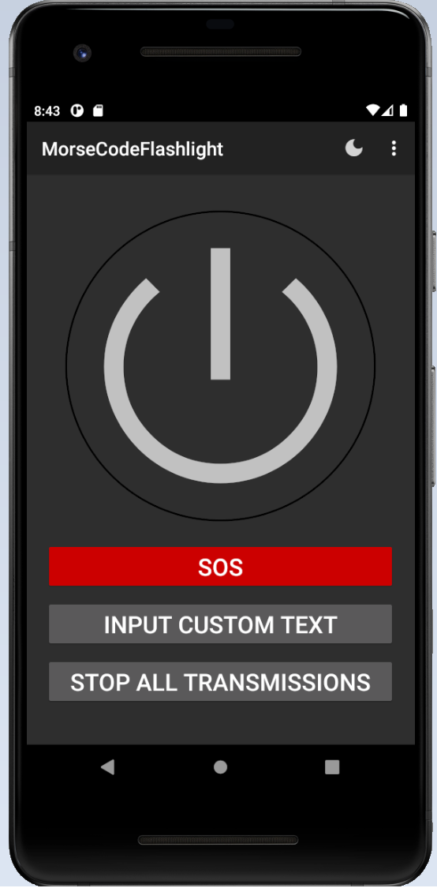
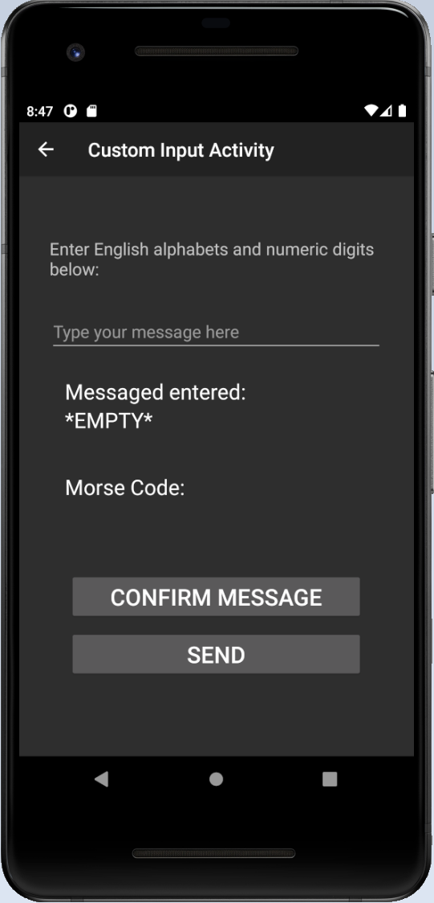

# Morse-Code-Flashlight

A simple flashlight app which allows you to use your device's flashlight to send out Morse Code messages.

Main Menu | Custom Input
--- | ---
 | 

## Description

Morse Code Flashlight is an app which helps users send out messages using their devices' flashlight in the form of Morse Code.
Users can also use this application as a basic flashlight app if their device does not have built-in flashlight support.

This app is my first Android app which I build independently without referencing any existing tutorials. The goal of building 
this app is to practice what I learnt from the [Official Android Developer Tutorial Courses](https://developer.android.com/courses), 
and this app also serves practical purposes.

This project is built with Java with Android's Room Database.

## Features
- Basic Flashlight (ON/OFF)
- Siren Flashlight (Rapid Flashing) by long pressing ON/OFF button
- SOS Morse Code Siren (Flashes SOS sequence indefinitely)
- Custom Morse Code Input (Translates user's sentence input into Morse Code)
- And more!

## Getting Started

### Dependencies

* Minimum Android SDK version: 22
* Recommended Android SDK version: 32

### Installing

#### For Developers:
1. Fork a copy to your own branch.
2. Use Android Studio or IntelliJ or equivalent IDEs to open the project.
3. Use your IDE's built-in AVD manager and run the app on a virtual device. Note the device requirements are in the dependencies section above.

#### For Common Users (APK To Be Released!):
1. Download the Android APK on the Releases section on GitHub.
2. Install the application by running the APK.

### Executing program

1. Begin using this extension by pinning the extension on the top right corner.
2. Open a website with HTML5 video element, e.g. any [YouTube](https://www.youtube.com) video and click on the Chrome Extension.

## Help

If you encounter any issues with the app, please close the app and restart it to see if the issue is resolved. If not, please leave a detailed description in the "issues" tab on GitHub to let me know.

## Authors

[Tyler-CY](https://github.com/Tyler-CY)

## Version History

* 1.0
    * Initial Release

## License

This project is licensed under the Tyler-CY License - see the LICENSE.md file for details

## Acknowledgments

* [Official Android Developer Tutorial Courses](https://developer.android.com/courses)
* [Official Android Developer Documentation](https://developer.android.com/docs)

